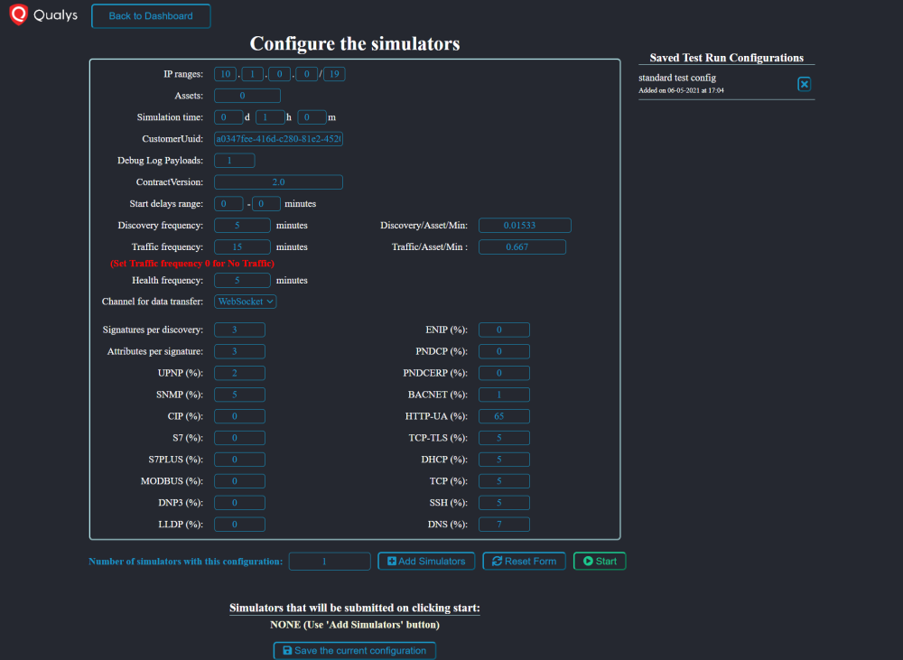
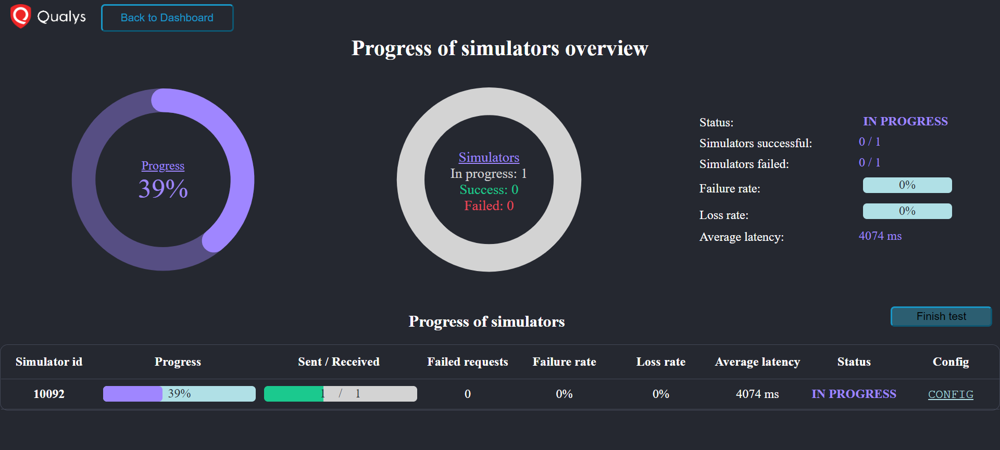
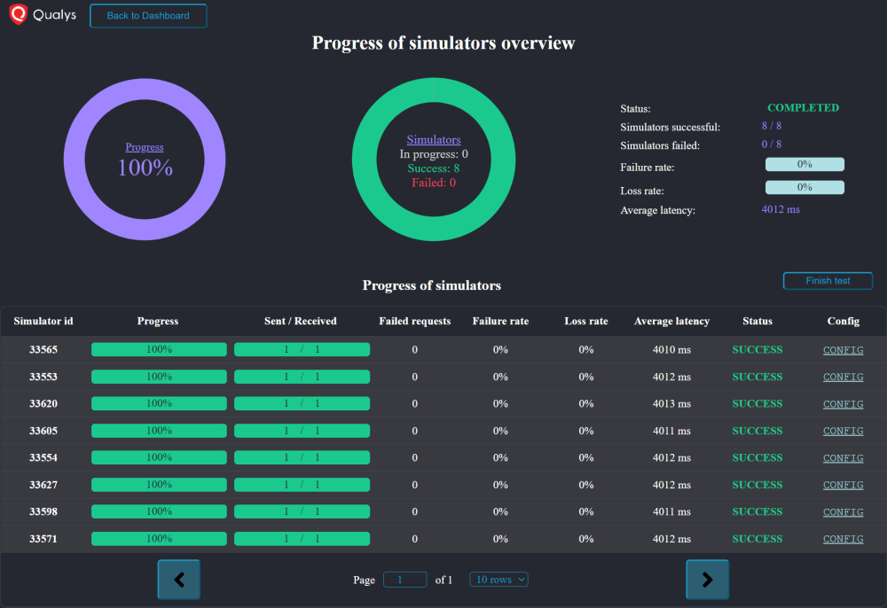
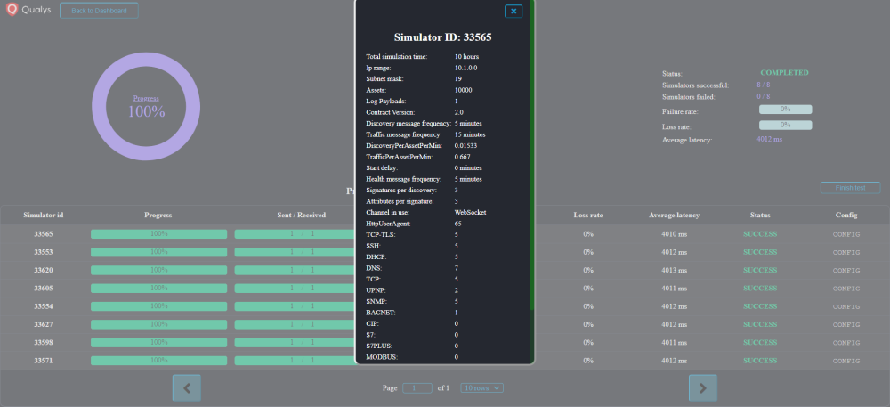
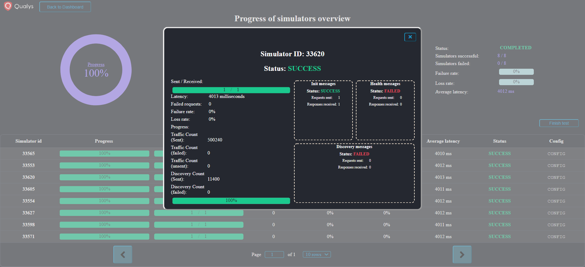
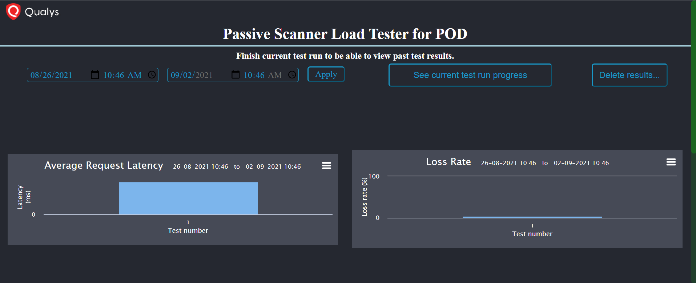

Before joining Qualys as an intern, I had just completed the Freshman year
of my undergraduate degree. I did not have any experience with languages
other than Java. Before starting, my manager revealed that the project would
be a web development project. I used this as an opportunity to learn some
new languages and skills early on. I learned the basics of HTML, CSS,
JavaScript, and ReactJS in the weeks leading to my internship. In fact, one
of my projects ([a typing game](/projects/type-or-die)) was a result of this
learning experience.

At Qualys, my project was to develop a completely new, standalone UI to load
test the Qualys cloud platform's Passive Scanner (PS) microservice. While
the scripts to generate and run the actual load testing HTTP requests were
being developed by a different part of the team in Node.js, my project was
to integrate a frontend UI with the scripts to make load testing a less
cumbersome task with interpretable statistics and visuals.

I first developed a server using ExpressJS and Node.js that served the
frontend UI, and also received inputs from the load testing scripts. For the
frontend itself, I used native HTML, CSS, and ReactJS without additional
libraries to create a single-page web UI. The frontend communicated with the
server using WebSockets as opposed to HTTP requests. This was a crucial
design choice because load testing generates a lot of data and a persistent
connection provided by a WebSocket is useful to continually update the UI.

The webapp was developed to show the same results and view to multiple
users. Form field data, progress data, and any other data that was displayed
through the UI was shared across all instances of the webapps through the
use of WebSockets. This meant that only a single load test could be run at a
given time but everyone could access the progress live and simultaneously.

The UI had a few different screens: a run configuration form to kick off
load testing, a display page that showed the test's progression, and a
dashboard that displayed historic results through charts using highcharts.
The following are a few screen captures of the webapp:

The form screen

The progress screen while running and after completion

The config and progress of a single simulator

The dashboard of graphs

The webapp was designed to have long-term storage of results and run
configurations using MongoDB. However, the webapp also had an "offline"
mode when it was not connected to the database. This mode allowed starting
load testing with some functionality disabled. Disabled functionality in
the offline mode included the use of saved run configurations, saving the
results to the database, and accessing the dashboard to view historic
charts.

During the internship, while developing a system to receive data in the
server and propagate it to the UI, I hit a dependency roadblock. I had to
interact with load test script developers to design a mutual config for how
the data would be formatted and what all data would be provided by the
scripts. However, after being roadblocked by the implementation of the
config for a while, I worked with the other developers to overcome this
roadblock. In the process, I learned about multi-processing for the first
time. I implemented a multi-process queue in Node.js that was shared by the
processes in the load testing scripts and the server as well. This allowed
a seamless transfer of data between the scripts and the server without any
additional network requests.

Towards the end of my internship, another team noticed my work and asked
if a similar web interface could be implemented for the load testing of
the Network Access Control (NAC) appliance. I modified the server interface
of the webapp to receive network traffic from a UDP socket instead of the
data from the Passive Scanner load testing scripts. Minor changes to the UI
and database allowed for a fully functioning framework for the NAC
appliance's testing as well. Working with this other team gave me some basic
insight about command-line networking tools such as netstat, netcat,
tcpdump, and wireshark.

Overall, it was a very fruitful internship in which I learned about a lot
of web development tools and languages, and also got an opportunity to work
on the actual load testing scripts that provided the data to the UI. As a
bonus, I learned some OS and networking concepts much earlier than I was
formally introduced to them at University.
