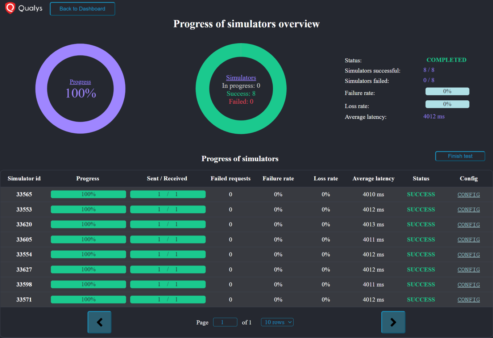

Before joining Qualys as an intern, I had just completed the Freshman year of
my undergraduate degree. I did not have experience with any languages other
than Java. Before starting, my manager revealed that the project would be a
web development project, and I used it as an opportunity to learn some
languages and skills early on. I learned the basics of HTML, CSS, JavaScript,
and ReactJS in the weeks before my internship. In fact, one of my projects
([a typing game](/projects/type-or-die)) was a result of this learning
experience.

At Qualys, my project was to develop a completely new, standalone UI to load
test the Qualys cloud platform's Passive Sensor (PS) microservice. While the
scripts to generate and run the actual load testing queries and HTTP requests
was being developed by a different part of the team in Node.js, my project
was to integrate a frontend UI that made load testing a task that has easily
interpretable and visual results.

I first developed a server using ExpressJS and Node.js that tended to the
frontend UI, and also received inputs from the load testing scripts. For the
frontend itself, I used native HTML, CSS, and ReactJS to create a single-page
web UI. The frontend communicated with the server using WebSockets as opposed
to HTTP requests. This was a crucial design choice moving forward because
load testing tends to generate a lot of data that needs to be parsed and
displayed continuously in the UI.

The webapp was developed to show the same results and view to multiple users.
Data in form fields, progress data, and any other data that was displayed
through the UI was shared across all instances of the webapps through the
use of WebSockets. This meant that only a single load test could be run at a
given time but everyone could access the progress and results live.

The UI had a few different screens: a form to kick off load testing scripts,
a display page that showed the test's progression, and a dashboard that
displayed historic results through charts using highcharts.js. The following
are a few screen captures of the webapp:

The form screen

The progress screen while running and after completion

The config and progress of a single simulator

The dashboard of graphs

The webapp was designed to have long-term storage of results and also the
initial form configurations using MongoDB. However, the webapp also had an
"offline" mode when it was not connected to the database. This mode allowed
starting load testing but without some functionality: saved form
configurations could not be used, the results would not be saved to the
database, and the dashboard to view historic charts could not be accessed.

While developing a system to receive data in the server and propagate it
to the UI, I hit a dependency roadblock of designing and implementing a
mutual config for how the data would be formatted and what all data would be
provided by the scripts. I helped the other team in overcoming these
roadblocks and in the process, I learned about multi-processing for the
first time. Additionally, I implemented a multi-process queue in Node.js that
was shared by the processes in the load testing scripts and the server as
well. This allowed a seamless transfer of data without any additional network
requests.

Towards the end of my internship, another team noticed my work and asked
if a similar web interface could be implemented for the load testing of
the Network Access Control (NAC) appliance. I modified the server interface
of the webapp to receive network traffic from a UDP socket instead of the
data from the PS load testing scripts. Minor changes to the UI and database
allowed for a fully functioning framework for the NAC appliance's testing
as well. Working with the other team gave me some basic insight about
command-line networking tools such as netstat, netcat, tcpdump, and
wireshark.

Overall, it was a very fruitful internship in which I learned about a lot
of web development tools and languages, and also got an opportunity to work
on the actual load testing scripts that provided the data to the UI. As a
bonus, I learned some OS and networking concepts a lot before I was formally
introduced to them at University.
