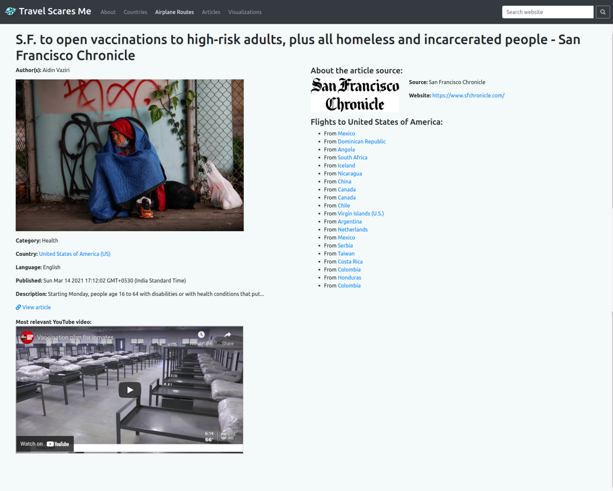

This was a semester-long web project developed as part of the
[CS373](https://www.cs.utexas.edu/users/downing/cs373/index.html) Software
Engineering course at UT Austin. The course aims to teach software development
practices, maintaining a workflow, handling issues, and continuous integration
(CI) similar to what developers deal with in the software industry. The
final web product had to be designed to have some form of utility for the
internet community.

**The website will be live only until December 2021 at
[https://www.travelscares.me](https://www.travelscares.me)**

The project's development was separated into 5 phases:
1. Planning and selection of data sources
2. Creating a static website with a few data records
3. Implementing a database and creating a dynamic website
4. Implementing sorting, filtering, searching
5. Creating data visualizations and final presentation

### Phase 1: Planning and selection of data sources

For the planning phase, we were supposed to select three _data models_ that
are interconnected in some way and have sufficient data to be considered
separate data models. Our team chose travel-planning in the COVID era as our
concept. Our goal was to create a website that showcased the COVID data of
various countries, travel advisories to the countries, the latest news from
the countries, and airplane routes between the countries. We chose our data
models to be countries, airplane routes, and news based on our goals. We also
selected a lot of different data sources to support our data models:
- Countries data through [Rest Countries API](https://restcountries.eu/)
- Travel advisories through
  [US Department of State API](https://www.state.gov/developer/)
- COVID data through [Covid19 API](https://api.covid19api.com/)
- COVID behavior data through
  [UMD Covidmap API](https://covidmap.umd.edu/api.html)
- Airplane routes through [Aviation Edge API](https://aviation-edge.com/)
- News articles through [NewsAPI](https://newsapi.org/docs/)
- News articles source logos through
  [SerpApi](https://serpapi.com/images-results)
- News videos through [YouTube API](https://developers.google.com/youtube/v3)
- Embedded maps through
  [Google Maps API](https://developers.google.com/maps/documentation/embed/get-started)

### Phase 2: Creating a static website with a few data records

The first step this phase was to reserve a domain name using Namecheap (one
domain free per student per year). The DNS routing was handled in a later
step once AWS was set up.

For the backend, we were required to use Postman to mock up the API routes we
would be serving with our backend in the next phase. I created mock API routes
and example JSON responses.

For the frontend, we were required to use ReactJS (with or without TypeScript).
We chose to use ReactJS with React Bootstrap for our website's styling. We
added the splash page, the about page, the data model pages and three
instances for each data model that are interlinked with each other.
Additionally, I spent a lot of time styling the about page and the instance
pages.

However, for this phase, a majority of the work was to set up a free account
on either the Amazon Web Services (AWS) platform or the Google Cloud Platform
(GCP) that would host both the frontend and the backend of our website. We
chose the AWS platform because of a bit of past familiarity and also finding a
[tutorial](https://adamraudonis.medium.com/how-to-deploy-a-website-on-aws-with-docker-flask-react-from-scratch-d0845ebd9da4)
that was easy to follow.

Using the tutorial, I set up a majority of our AWS architecture. This included
using Certificate Manager to set up the DNS routing for the Namecheap domain,
and using S3 and CloudFront for deploying our frontend webpages. I also
further set up a container using Elastic Beanstalk (EB) and Elastic Container
Registry (ECR) to host our future backend.

This is the splash page when visiting the website

This is the about page that uses the GitLab API for development statistics

### Phase 3: Implementing a database and creating a dynamic website

This phase had the largest workload because of the requirement of a functional
database with lots of data and a working backend. I scraped data from the
chosen data sources, then reformatted the data into a format that allowed
loading the data into a MySQL database. We set up a MySQL database using AWS
Relational Database Service (RDS) that would serve all our backend database
requests.

The frontend was served using a backend server made with Python Flask. The
database data was modeled using SQLAlchemy and Marshmallow before being served
to the frontend through different API routes as mocked in Postman earlier.
Because of our large amount of data, I made the decision to paginate the data
within the backend itself, instead of serving the frontend with thousands of
data records per data model. A docker image of the backend was created and
loaded to AWS ECR for AWS EB to read and host from.

For the frontend, we had to convert our static instance pages to pages that
would query the backend for the appropriate data and then display it. Another
important aspect was to add pagination to the frontend because of the large
number of data records. We allowed changing both the page number and page
size of data records.

I spent some time adding YouTube videos and embedded Google Maps to the
instance pages using API keys from GCP. These were the only pieces of data
that were queried directly instead of being stored in the database.
Additionally, I spent quite a decent amount of time styling the frontend,
especially the model pages and navigation.

These are the countries model page and instance pages

These are the airplane routes model page and instance pages

These are the news articles model page and instance pages

### Phase 4: Implementing sorting, filtering, searching

The purpose of this phase was to provide the website some actual functionality.
Without any form of filtering, sorting, or searching implemented, a user may
not accomplish much from the website.

For the data, we had two choices of implementation to move forward with. The
first was to serve all the data to the frontend and then use Algolia to
perform any filtering, sorting, or searching. I chose the second option which
improved on our existing backend architecture by performing the filtering,
sorting, and searching using SQLAlchemy. I implemented a variety of API query
parameters for each data model, which I also documented in
[Postman](https://documenter.getpostman.com/view/14734911/Tz5jeL2c) with
examples.

For the frontend, we had to implement the filtering and sorting options into
each data model according to the query params available for each data model.
We created a modal to change filtering parameters and added a dropdown
to change the sorting parameter. Additionally, a search bar was added to each
data model page and a global search bar was also added to the navigation. I
implemented the global search page which used the search option from each of
the data model APIs to combine the data and display it. Lastly, the keywords
from the search were highlighted in each data record.

This is an example of filtering and sorting results in a data model page

This is an example of using the global search functionality with highlighting

### Phase 5: Creating data visualizations and final presentation

In the last phase, we had to create data visualizations using our own exposed
API and the exposed API of another team's website. The visualizations could be
generated using any frontend charts library. Popular libraries included D3js,
Highcharts, and React Google Charts. We used the last option because of its
comprehensible documentation.

We were also responsible for documenting the functionality of the website
through a presentation. A demo of our completed website can always be viewed
on [YouTube](https://www.youtube.com/watch?v=fWFjnH2Fas4).

This is an example of a visualization using our API. I unfortunately don't
have a visualization of using the API of another team as they took down their
server.

### Additional Continuous Learning

Throughout the entire project, we were writing **test cases** using Jest for
the frontend, Selenium for the UI, Python unittest for the backend, and Postman
for the API. This is similar to the industry where every component of a
product needs to be thoroughly tested. These were integrated using GitLab's
**CI** tools and Docker images, implying every commit to the repository
automatically invoked the running of the test cases in GitLab's pipelines.

Additionally, each team was a "client" to another team and as a client, our
responsibilities included creating **user stories** for the other team to
improve their website interface, evaluating their response to our user
stories, and using their exposed API to generate visualizations on our website
during Phase 5. Similarly, we were responsible for working on user stories
addressed to us by a different team, and also responsible for exposing a good
API for them to use during Phase 5.

Lastly, we had to keep updating an ongoing **technical report** that
documented every aspect of our project, from the data models to the AWS
architecture to the actual backend and UI implementation. You can read the
entirety of the technical report [here](/tsm_technical_report.pdf).
