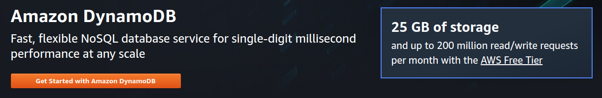
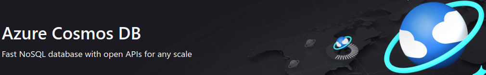
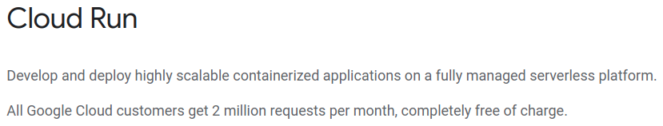

This blog describes the journey that I, a developer took to decide the
architecture to use for the implementation of a recent project I have been
working on. It demonstrates the thought process a developer goes through to
come to a resolution.

<!--excerpt-->

Let's commence the journey!

When you have an idea that you want to implement, as an individual developer,
or maybe even as a part of an organization, you look for the cheapest and
easiest solutions for the architecture of your implementation. That is exactly
what I did as well when I started the implementation of my web project (**top
secret**). My project involves dealing with a lot of data, but originally, I
thought that it wasn't nearly enough data to justify the need for a backend. I
decided to stick with my familiarity and host a static website for free on
GitHub Pages as I have previously done (this website!).

### Static website with GitHub Pages

#### Problem 1
As I started generating and cleaning my data, I realized that in a static
website, any data that I store would be directly accessible by anyone visiting
the website by simply opening the developer console in the browser and looking
at the network traffic or the sources. This was a no-go in my situation as I
needed the data to not be visible directly to the user. I researched numerous
ways of encryption and decryption and decided to use AES to encrypt all the
data and only decrypt something when it is needed. I thought that would be it,
but that's when I ran into another problem.

#### Problem 2
As I generated more data, I realized I had upwards of 600MB of data. Now, for
a static website, this is a problem, because every time the website is
accessed, all that data will have to be loaded by the browser. Slow internet
connections will really struggle with the website. However, I was
tunnel-visioned to use a free static website host and was determined to make
it work. But with more time and a few days of wasted work, I decided to
abandon the static website approach and concluded that I would need a proper
backend or at least a database.

### The quest for a database

The data that I had was a lot of nested JSONs (up to 5 or 6 levels deep). This
data was hierarchical in nature and a structured database such as MySQL or
PostgreSQL would be of no use, or at the very least, it would be a lot of work
to transform the data into a format that would suit those structured
databases. Alright, so let's look at the options.

#### Heroku
I first looked at Heroku's free tier. Unfortunately, while Heroku did have
free options to run a backend service, I wasn't satisfied with their support
for NoSQL databases. They offered **Redis** and **MongoDB**. While Redis was
suitable for my project, the free limit was far too low, and MongoDB was
outright unsuitable based on my prior experience.

#### Amazon Web Services (AWS)
I then thought I would take a look at AWS. AWS offered **DynamoDB**, a NoSQL
database with monthly free limits that were well suited for my purposes.
However, I did not have a very good time with AWS in the past when I used it
for two university projects ([Deepfakes](\projects\deepfakes) and 
[Travel Scares Me](\projects\travel-scares-me)) because the documentation is
very unnerving, and you often have to rely on tutorials. I kept this as a
backup plan if I could not find anything better.

#### Microsoft Azure
Next up, Azure. I had never used or considered Azure before for any of my
projects. This probably was a bias for me when I looked at Azure **CosmosDB**.
Similar to Heroku, they offered support for **MongoDB**, but also for
**Cassandra**, which I had not used before and wasn't exactly sure was right
for my use case. With my existing bias, when I noticed that CosmosDB was only
free for 12 months, I steered away (sorry Azure).

#### Google Cloud Platform (GCP)
Last stop was GCP. I had previously only used GCP for getting access to API
keys for Google Maps and Google Translate. I had some familiarity with their
console. So, imagine my delight when I learned that the **Cloud Firestore**
was created to solve problems almost identical to mine. Remember when I said
my data was all JSONs? Well, straight from Firestore documentation: "You may
notice that documents look a lot like JSON. In fact, they basically are. ...
in general, you can treat documents as lightweight JSON records."

However, this time I wanted to be more careful and make sure all my
requirements can be fulfilled by GCP before moving forward with Firestore. I
found that Google Compute Engine (GCE) provided a free virtual machine (VM)
instance that, from a preliminary estimate, could host both my frontend and
backend. I was all set, or so I thought.

### The data dilemma

#### Shock #1
As I said before, I had a lot of data. However, this data was unchanging. This
meant that I had to write the data to Firestore only once, and read as
necessary in the future. As I thought about that, I was hit with an unpleasant
realization. If I had to write 600MB of data to Firestore as individual JSON
documents, that would amount to over 5,500,000 writes. The daily limit for
writes to Firestore is 20,000. It would take me 9 months to write all my data
to Firestore if I wanted to stick to free limits! At that one moment, I
wished I had chosen DynamoDB which has a monthly limit as opposed to a daily
limit. But I decided to soldier on.

I found ways to reduce the size of my data to 150MB and even shift some of the
data computation to the backend instead of computing everything beforehand and
pre-caching. This brought down the writes to about 6000! So, I immediately
decided to test this - at worst I would lose a day or two messing with the
data while staying under the free limits...

#### Shock #2
Firestore reads have a limit too, 50,000 a day to be precise. By shifting a
majority of the computation to the backend from pre-caching, I had essentially
skyrocketed the number of reads I would be needing to serve each request by
the frontend. I was needing close to 1300 reads to serve a single request!
This means I would only be able to serve 38 requests a day, which is simply
pathetic. This essentially made the idea of using Firestore for pre-caching
the data unviable.

#### Resolution
After battling with different amounts of pre-caching in Firestore, something
suddenly clicked in my mind. Why do I even need to pre-cache in Firestore!?
I could pre-cache in the backend itself in-memory. It would not only be
faster to work with in-memory computations, but I won't have to deal with
Firestore as much anymore. It would result in a lengthy cold start for the
first request because of the minimal amount of reads from Firestore and some
relatively heavy computation involved in the pre-caching, but this was
something I was ready to deal with. So now all that was left was to set up
instances for the frontend and backend.

### Hosting the website

When I had picked GCP as the cloud platform to host my website, I was only
aware of Google Compute Engine (GCE) as a platform to host services.

#### Google Compute Engine (GCE)
GCE's free tier includes a single e2-micro instance, which provides 0.25 vCPUs
(virtual CPUs) and 1GB RAM. Even though my preliminary estimates had convinced
me that this would be sufficient to host both my frontend and backend, I had
started to second guess that estimate. Additionally, working with GCE is akin
to working on a fresh virtual machine because GCE is an [Infrastructure as a
Service (IaaS)](https://en.wikipedia.org/wiki/Infrastructure_as_a_service).
I was not keen on having to deal with disk images and especially network
routing, so I started looking for alternatives within GCP.

#### Google App Engine (GAE)
As I scoured the GCP documentation and products, I found GAE. As opposed to
GCE, GAE is a [Platform as a Service
(PaaS)](https://en.wikipedia.org/wiki/Platform_as_a_service). GAE provides
F-instances and B-instances which each scale in a different manner -
F-instances autoscale, B-instances are manually scaled. GAE's free tier
includes 28hrs/day of F1-instances (256MB RAM, 600MHz CPU limit) and 9hrs/day
of B2-instances (512MB RAM, 1.2GHz CPU limit). Historically, F-instances were
intended for frontend services, and B-instances were intended for backend
services. Though that is not the case anymore, I decided to follow it that
way.

I deployed my frontend and backend services to GAE using an F1-instance and
a B2-instance respectively. It was as simple as creating two YAML files for
the configuration of the instances and another YAML file for the routing
between the instances. The frontend service worked perfectly without any
hassles, however, my backend service showed some erratic behavior by randomly
shutting down.

I wasn't exactly sure what the problem was so the first thing I did was to run
memory profilers on my backend application. I learned one important lesson by
doing this. There is a difference between how much space the data takes on
disk in JSON format as compared to using Python dictionaries in memory. While
on disk the data was 150MB, the backend process was using closer to 380MB.
Interestingly, this was still within the B2-instance memory limit. I
struggled to find an answer for the erratic behavior and even posted to
StackOverflow which I don't usually do unless I am desperate (which I was at
this point).

I started to look for other solutions to the problem, and that's when I found
yet another product of GCP... The gift that keeps giving, isn't it?

#### Google Cloud Run

I randomly found Cloud Run when I was looking at the GCP dashboard. I didn't
know what it did, but it was under the same category as GAE, so I tried
researching it. I learned that Cloud Run is also a PaaS product that can be
used as a replacement for GAE and has even lesser maintenance overheads (no
need for even a YAML configuration!) Additionally, the scaling of Cloud Run
is easier to understand than having to pick from the different instance
options that GAE offers.

I also learned that GAE uses virtual machines underneath (essentially built
over GCE) while Cloud Run is built over Google Kubernetes Engine (GKE).
Considering how much Google is now pushing Kubernetes as a scaling solution,
I am surprised Cloud Run does not seem as popular as App Engine (judging
based on the resources available outside documentation).

Anyways, Cloud Run had a really simple learning curve, and I could essentially
move my backend service that was built for GAE to Cloud Run with almost no
changes and just Dockerizing my app. I was however concerned about the free
tier limits as they felt rather cryptic to the naked eye. However,
[GCP's Pricing Calculator](https://cloud.google.com/products/calculator)
seemed to promise great limits within the free tier based on my needs. Note
that I still believed that 512MB of RAM would be sufficient for my service
based on my App Engine experience.

I deployed my backend to Cloud Run and started testing it. To my
disappointment, the service was still erratically shutting down. I dove into
debugging once again. Based on a hunch and logs (yes, Cloud Run has logs!), I
investigated the memory usage once again. I read about the [`memory_info`
function](https://psutil.readthedocs.io/en/latest/#psutil.Process.memory_info)
in the `psutil` module in Python that I was using for memory profiling and
learned about two different metrics for the memory usage of a process! What I
had originally looked at was the Resident Set Size (RSS) which amounted to
about 380MB. However, what was important to consider was the Virtual Memory
Size (VMS) or the total amount of memory used by a process including shared
libraries (Should have paid more attention in that OS class...)
Well, this VMS metric revealed that my service actually required closer to
850MB memory. I think this is a lesson to stay light on the number of
libraries your application is using.

Stumped with being unable to reduce my process size significantly, I decided
to simply increase the memory limit to 1GB in my Cloud Run instance. And just
like that, my backend service started working as intended. However, I am still
monitoring the billing aspect of this memory limit increase, which seems to
be nil for the moment. In hindsight, I wonder if the shift from GAE to Cloud
Run was even necessary. It does seem to bring larger benefits, more
flexibility, and simpler to understand scaling of instances, so I can only
hope it wasn't in vain!

### Epilogue

As a developer, this blog describes a journey that probably was relatable to
you if you are a developer as well. You often start with assumptions that may
or may not be true. You explore different paths to try and build your product
under those assumptions, but they just won't work at times. But with the
endless amount of technology now available, and with the entire Cloud at our
disposal, the developer journey sure has become more enjoyable.
