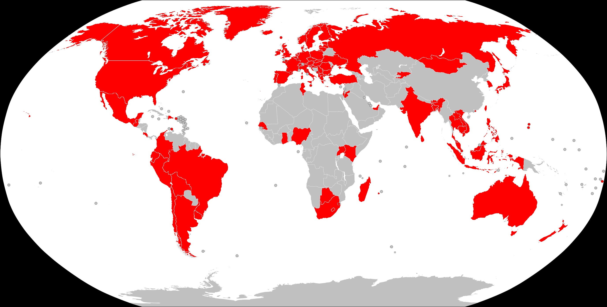
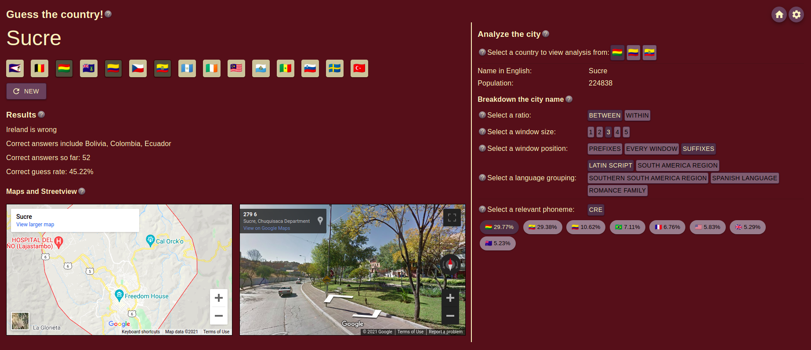

I started playing a game called [GeoGuessr](https://www.geoguessr.com/) in
February 2021 when I came across a YouTube video. I always had an avid
interest in geography, so I was genuinely surprised I hadn't come across the
game any earlier. Basically, the game involves guessing the location of a
place based on the Street View that you are shown. The objective is simple but
the logic that is used in guessing the location is quite complicated. New
players can quickly get overwhelmed by the number of different inputs they
receive by viewing a single frame of Street View. The following are some
aspects that can go into guessing a location:

- Countries available in Street View (currently 104, see image below)
- Driving direction
- Language script
- Structure of words and names (linguistics)
- License plates
- Street signs
- Terrain
- Flora
- Weather
- Car and camera equipment used for mapping the streets
  ([metagame](https://en.wikipedia.org/wiki/Metagaming), frowned upon)

I learned a lot about driving, street signs, license plates, terrain, and
flora through different online guides and YouTube videos. However, I wasn't
able to find comprehensive guides to understand differences between language
scripts (especially different Latin-based scripts and Cyrillic-based scripts).
I had to look at the entire scripts of the languages through Wikipedia and
other resources.

### The new game

I decided that better language-oriented GeoGuessr resources are needed and
came up with the idea of a learning game: Geo City Learner. The game helps
learn what city names can be associated with what countries based on the
languages spoken in the countries, and the scripts and letter patterns used in
those languages.

How the game works is simple. A city name is displayed to the player. They
need to guess what country the city is located in (could be multiple right
answers). Once the player guesses, they receive a summary of their guess,
details about the city, and Google Map and Street View of the city's location
in the world. Most importantly, through the game, I provide probabilistic
information based on the [phonemes](https://en.wikipedia.org/wiki/Phoneme)
used in the city names. New players can benefit from simple information such
as what letters are present in what languages, while veterans can take it a
step further and learn digrams, trigrams, prefixes, and suffixes etc.

### Data

I generated the data in two steps. I used an
[opendatasoft database](https://public.opendatasoft.com/explore/dataset/geonames-all-cities-with-a-population-1000)
of city names from the 104 countries that are available in Street View. This
dataset was not fully clean and was missing the population for some cities.
It also did not have a clear pattern for the city names translated to other
languages. It also often did not have the translation of the city name
available in the native language(s) of the country.

I cleaned the dataset and used Google Translate's API to translate the names
into their native languages. I would have preferred using a transliteration
API instead but unfortunately Google abandoned their Input Tools development
leaving it with a very limited choice of languages. The translation was often
broken or translated incorrectly when the API mistook proper nouns (cities)
for common nouns with the same or a similar spelling. I fixed the broken
translations manually, but a fix for the incorrect translation is a job for
the future that I might have to crowdsource since there are close to a 100,000
cities in my final dataset.

### Development

I spent a lot of initial time on the data to decide whether the project is
viable or not. Once I decided it was, I had to work on deciding a suitable
architecture for creating a website, storing the data, and hosting the
website. In fact, some of my development process for the project is mentioned
in a [blog post](/blogs/dev-journey-architecture) of mine.

I chose to store and load the data into a backend server as JSONs after using
a database such as Google Cloud Firestore proved to be too slow for my
purposes. The backend server is written in Python Flask and performs any
computations and transformations of the data. A lot of data is cached during a
slow start to allow faster server times overall even though the first request
may take longer. This server is hosted on Google Cloud Run.

The frontend for the website is designed with ReactJS and Material UI. The
static webpages are served using a Node.js + Express.js server that acts as
a middleware to glue the actual backend server with the frontend. This server
allows for some basic authentication involving cookies and AES-encrypted
tokens. This authentication is not to necessarily establish a user or secure
the API, but rather to discourage cheating and free use of the backend API.

### Further development

There is still a ways to go. I will be releasing the game on the
[r/geoguessr subreddit](https://www.reddit.com/r/geoguessr/) to receive
feedback on what improvements can be made to the game to make it more viable.
Some ideas I currently have floating in the back of my head include:
- Personalizing the cities that are displayed for guessing based on how
  often the user incorrectly guesses a country.
- Adding multiple languages per country. Currently, I have limited each
  country to be associated with a single language which is wildly incorrect.
- Add a potential log-in system.
